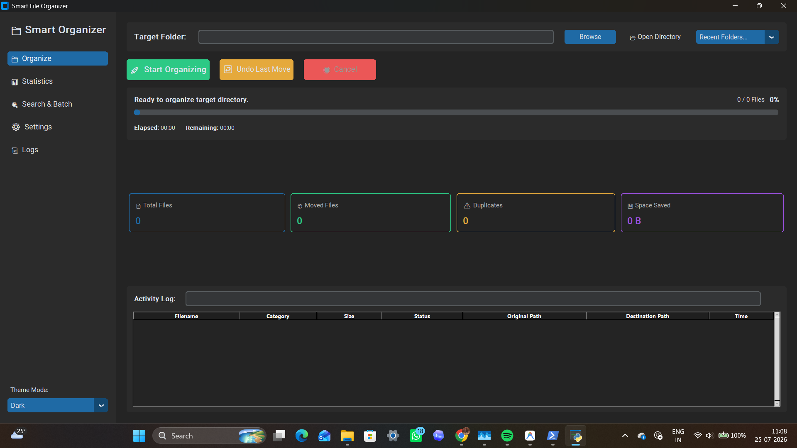
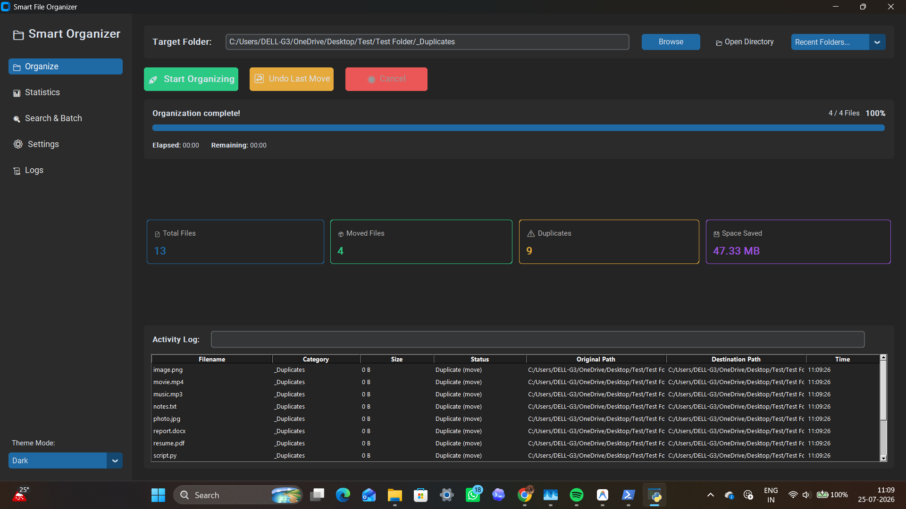
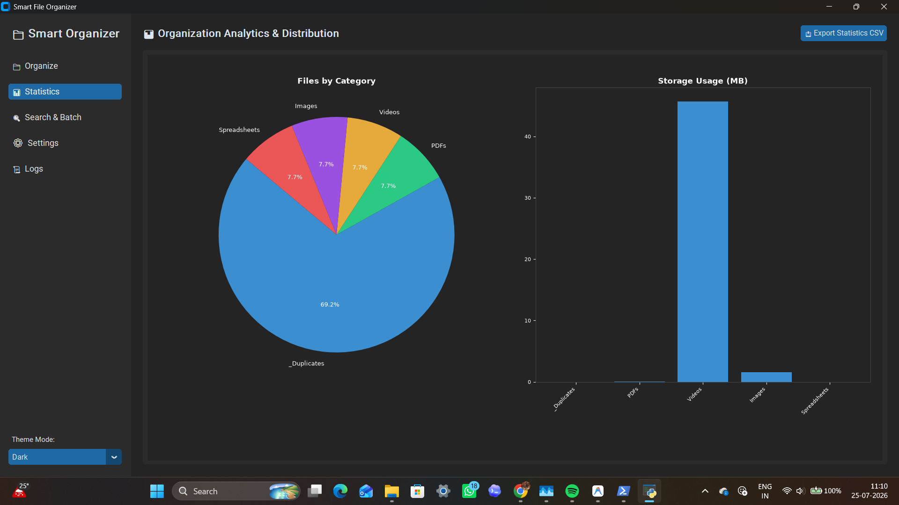
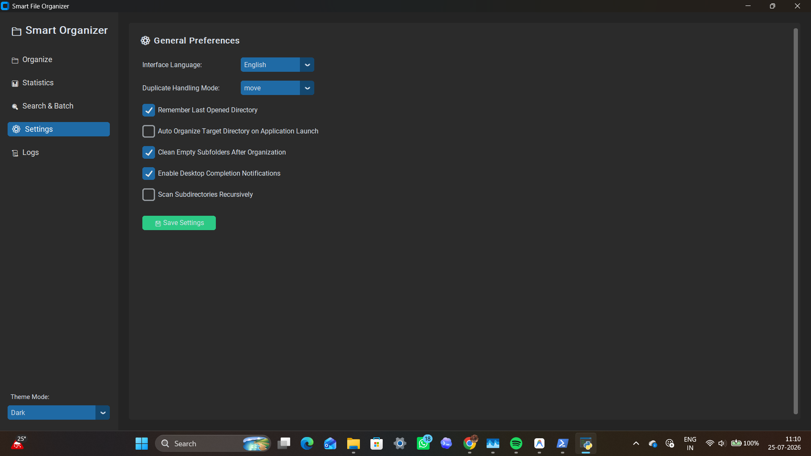
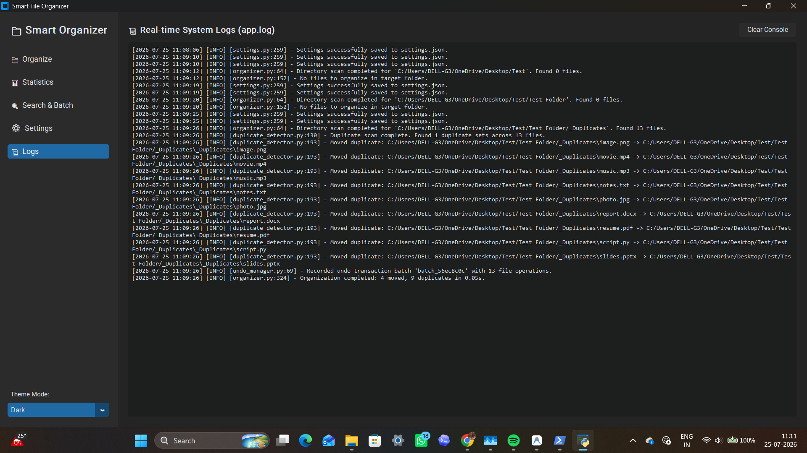

# 📁 Smart File Organizer

<p align="center">
  <strong>A modern Python desktop application that intelligently organizes files using category detection, SHA-256 duplicate analysis, undo support, batch renaming, and real-time statistics.</strong>
</p>

<p align="center">


</p>

---

## ✨ Overview

Smart File Organizer is a desktop application built with **Python** and **CustomTkinter** that automatically organizes files into categorized folders based on file type. It includes **SHA-256 duplicate detection**, **Undo support**, **Batch Rename**, **CSV report generation**, **Activity Logs**, and **Real-time Statistics**.

Designed with a modern interface and modular architecture, the project demonstrates practical software engineering concepts including multithreading, file system operations, configuration management, and logging.

---

# 🚀 Features

- 📂 Automatic file organization
- 🔍 SHA-256 duplicate detection
- ↩ Undo last organization
- 📊 Live statistics dashboard
- 📝 Activity logs
- 📦 Batch Rename utility
- 📈 CSV report export
- ⚙ Custom organization rules
- 🌍 Multi-language support
- 🌙 Dark / Light theme
- 🔔 Desktop notifications
- ⚡ Multi-threaded processing
- 🗂 Recent folders
- 🧹 Empty folder cleanup

---

# 📸 Screenshots


### 🏠 Home


### 📂 Organizing Files


### 📊 Statistics Dashboard


### ⚙️ Settings


### 📜 System Logs



---

# 🏗 Project Structure

```text
smart-file-organizer/
│
├── app.py
├── organizer.py
├── duplicate_detector.py
├── undo_manager.py
├── settings.py
├── utils.py
├── logger.py
│
├── assets/
│   ├── screenshots/
│   └── demo.gif
│
├── logs/
│
├── requirements.txt
├── LICENSE
├── README.md
└── .gitignore
```

---

# ⚙ Installation

Clone the repository

```bash
git clone https://github.com/vinit-0110/smart-file-organizer.git
```

Go into the project

```bash
cd smart-file-organizer
```

Create a virtual environment

```bash
python -m venv .venv
```

Activate it

### Windows

```bash
.venv\Scripts\activate
```

Install dependencies

```bash
pip install -r requirements.txt
```

Run the application

```bash
python app.py
```

---

# 🛠 Technologies Used

- Python 3
- CustomTkinter
- Pillow
- SHA-256 Hashing
- Threading
- JSON
- Logging
- File System APIs

---

# 🧠 Architecture

```text
                 Smart File Organizer

                      app.py
                         │
     ┌───────────────────┼───────────────────┐
     │                   │                   │
 Settings          Organizer Engine      Logger
     │                   │
     │         Duplicate Detector
     │                   │
     │            Undo Manager
     │                   │
     └────────────── Utilities ──────────────┘
```

---

# 📊 Highlights

- Modular architecture
- Object-Oriented Design
- Multi-threaded processing
- Efficient duplicate detection
- Undo support
- Configuration persistence
- Activity logging
- CSV reporting

---

# 🔮 Future Improvements

- AI-powered file categorization
- Cloud storage integration
- Automatic scheduling
- Drag & Drop support
- Plugin architecture
- Advanced search filters

---

# 📄 License

This project is licensed under the **MIT License**.

---

# 👨‍💻 Author

**Vinit Gajjar**

- GitHub: https://github.com/vinit-0110

---

⭐ If you found this project useful, consider giving it a star!
